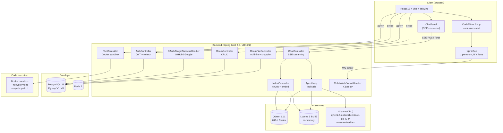
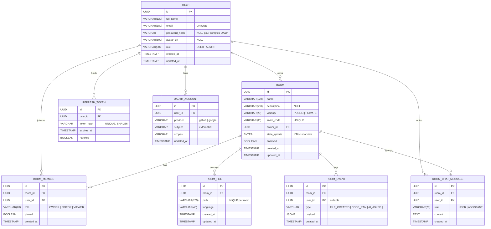
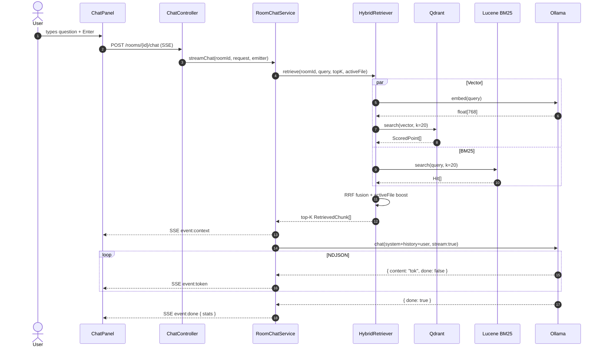
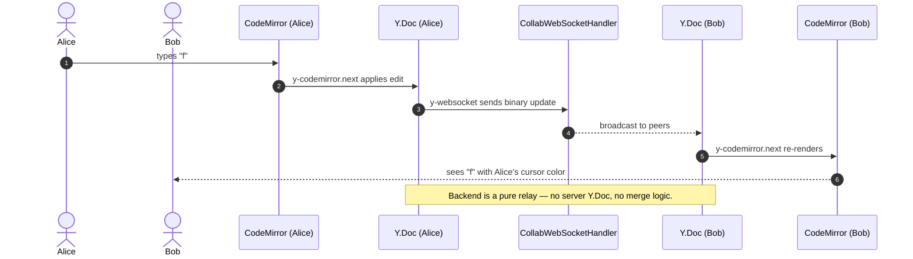

<div align="center">

# 🦎 Codeleon

**Code + Caméléon** — a self-hosted collaborative coding platform with
real-time multi-cursor editing, sandboxed code execution, and a local
retrieval-augmented AI assistant.

[](backend/pom.xml)
[](frontend-web/package.json)
[](frontend-web/src/lib/collab)
[-9333EA)](docker-compose.yml)
[](docs/deployment-rationale.md)
[](#license)

</div>

---

## 📖 What is Codeleon?

Codeleon is the **self-hosted, all-batteries-included alternative to a
Google-Docs-for-code**. Open a room, share an invite link, type
together with live cursors, ask the local AI assistant about *your own
code* without sending a byte to the cloud, and run it in a Docker
sandbox with one click.

It is a final-year project (PFE) for Licence Pro Génie Logiciel,
Faculté Polydisciplinaire de Taza — academic year 2025-2026. Built
end-to-end as a single-developer project: backend, frontend, RAG
pipeline, agent loop, infrastructure, and security posture.

The product story: **collaborative coding without giving up
sovereignty over your code, your data, or your bill**.

---

## ✨ Highlights

| Feature | Tech |
|---|---|
| **Real-time collaborative editor** with multi-cursor + presence | Yjs CRDT + `y-codemirror.next` + WebSocket binary relay |
| **Multi-file workspace** with VSCode-style tabs, file explorer, right-click menus | React + Radix Context Menu / Menubar / Dialog |
| **Code execution sandbox** | Docker `python:3.12-slim`, `eclipse-temurin:21-jdk`, Maven dependency builds, Nix project environments |
| **Local RAG AI assistant** with streaming SSE, auto-indexing, chat history, retrieved context drawer | Ollama (`qwen2.5-coder:7b-instruct-q4_K_M` + `nomic-embed-text`) + Qdrant 1.11 |
| **Agent mode** with tool calls (`list_files`, `read_file`, `search_code`, `semantic_search`, `propose_patch`) — patches are user-applied via CRDT | Custom agent loop + content fallback parser for non-strict tool calling |
| **Hybrid retrieval** = dense embeddings + Lucene BM25 fused with Reciprocal Rank Fusion (RRF) | Lucene 9 + Qdrant + RRF k=60 |
| **AST chunking** — code split by symbol (method / class / function) with line attribution | JavaParser + regex chunkers per language |
| **Project import** from local folder or any public/private GitHub repo | `webkitdirectory` + GitHub OAuth token + ZIP fetch |
| **Project dashboard** with cards, templates, pin/archive, activity feed | React Query + Spring REST + Flyway-managed events |
| **Auth** with JWT email/password + OAuth2 (GitHub in prod, Google in dev) | Spring Security 6 + custom programmatic `ClientRegistrationRepository` |
| **Production deployment** on a 5 €/month Hetzner VM, exposed only via Tailscale | Hetzner + Docker Compose + Caddy + Tailscale + UFW + fail2ban |

---

## 📸 Screenshots

> Screenshots live in [`docs/screenshots/`](docs/screenshots/). Take
> them with `https://ubuntu-8gb-hel1-1.taild1d23e.ts.net` (or the local
> `http://localhost:5173` dev URL) and a 1920×1080 viewport for a
> consistent look.

### Landing / marketing


**What you see**: the public-facing landing page rendered without
authentication. Animated mesh gradient backdrop (3 indigo / cyan /
violet orbs drifting via pure CSS keyframes — no canvas, no JS
animation loop). Header includes a CTA to **Sign in** and **Create
account**. Designed as the first impression that lasts ≤ 6 seconds
before the user decides whether to engage.

### Sign in / Sign up


**What you see**: two-column auth layout (`AuthShell`). Left side
showcases the value proposition with three signals (Live rooms,
Private AI, Safe execution). Right side is a card with the form,
glass-effect borders thanks to `backdrop-blur-xl`, and OAuth buttons
that appear conditionally based on `GET /api/v1/auth/providers`. The
animated backdrop runs at the *showcase* intensity — auth pages are
the moment to wow.

### Dashboard


**What you see**: the operator's home base.

- **Left sidebar** — primary nav (My projects, Public projects,
  Integrations). Collapsible to a drawer on mobile/tablet via a
  hamburger.
- **Stat tiles** — projects / files / collaborators counts at a glance.
- **Project cards grid** — each card carries name, owner, file count,
  member count, last-edited-by, visibility chip (private/public) and
  the invite code in monospace (click to copy). Hover lifts the card
  and reveals a glow border.
- **Create / Join** — side-by-side cards. Create supports blank,
  local-folder upload, GitHub import, or a starter template.
- **Recent activity feed** (right) — cross-room timeline showing file
  creations, runs, AI questions. Persists per user in
  `localStorage` so the panel state survives reloads. Collapsible via
  the header toggle on `xl:` and up.

### Room workspace


**What you see**: the heart of the product.

- **Top bar** — back arrow, room name, connection dot, **Invite**,
  **Run file** (or **Run project**), and two icon toggles that
  show/hide the file explorer and AI panel.
- **File explorer** (left) — flat list of every file in the room,
  context-menu actions (new / rename / delete), upload from local
  folder.
- **Editor** (center) — CodeMirror 6 with `y-codemirror.next` binding.
  Each peer renders their cursor in a unique color via Yjs awareness.
- **Tabs** — VSCode-style multi-file tabs with close buttons.
- **AI panel** (right) — chat with the local assistant, fullscreen
  toggle (modal overlay), agent-mode switch.
- **Output strip** (bottom) — thin always-visible bar shows the last
  exit code in green / red / amber. Click to expand. Auto-expands when
  a run starts. Drag the border to resize.
- **Status bar** (very bottom) — flat VSCode-style strip with Live /
  N online / active file / Private AI / project env / sandbox status.

### AI chat (RAG mode)


**What you see**: a question typed in the panel, streamed answer with
provenance.

- **Context drawer** above the bubbles — shows which files / chunks
  were retrieved by the hybrid RAG (vector + BM25), each chip
  clickable to jump to that file and line in the editor.
- **Bubbles** — markdown-rendered with code blocks. Streaming uses
  Server-Sent Events; each `event:token` line appends to the last
  bubble live.
- **Slash commands** below the input (`/explain`, `/fix`, `/test`,
  `/refactor`) appear only when the input is empty.
- **Index status** + manual refresh — one compact row, the index
  itself runs automatically before every chat turn when the project
  changed.

### Agent mode


**What you see**: same panel with the **agent** toggle (lightning
icon, cyan) on. The bubbles are interleaved with tool-call cards:

- **Tool call card** — name + arguments preview, status pill
  (running / done / error).
- **Patch proposal card** — diff with **Apply** / **Reject** buttons.
  Apply writes the patch to the bound `Y.Text`, which the CRDT
  propagates to every connected peer instantly. No server-side `Y.Doc`
  mutation needed.

### Output panel (run result)


**What you see**: collapsed by default. When expanded:
- **PROJECT COMMAND** column — only shown for project runs (Maven, Nix).
- **OUTPUT** column — stdout + stderr, monospace, ANSI-rendered.
- **STDIN** column — text area for the next run's input.
- Exit code, duration, runner image, cache volumes used — all surfaced
  at the top.

### Admin dashboard


**What you see** (visible only when `User.role = ADMIN`):
- User list with role management.
- Room overview with delete actions.
- Aggregate stats — users joined last 7 days, RAG chunks indexed,
  Qdrant infrastructure health.
- **AI metrics tab** — counters (chat turns / agent turns / tool
  calls per name), latency histogram (p50 / p95 / max via NIST
  nearest-rank), recent queries with `mode` and `failed` flag.

---

## 🧰 Tools and Technologies

A walkthrough of every major dependency and *why* it was picked.

### Frontend

| Tool | Role | Why this and not the alternative |
|------|------|----------------------------------|
| **React 18** | UI library | Industry standard, vast ecosystem (CodeMirror, Radix, React Query). Concurrent rendering helps with the SSE token stream UX. |
| **Vite 5** | Build tool | Fast cold start, fast HMR, smaller bundles than Webpack. Build artefact is plain static files served by nginx in prod. |
| **TypeScript 5.4** | Type system | Catches API-shape mismatches between backend DTOs and frontend types at build time. |
| **Tailwind 3** | Styling | Utility-first means consistent spacing / colors via design tokens. No CSS-in-JS runtime overhead. |
| **CodeMirror 6** | Code editor | Modular, themeable, smaller than Monaco, plays well with Yjs via `y-codemirror.next`. |
| **Yjs** | CRDT | Conflict-free replicated data type for collaborative editing. Awareness API exposes peer cursors + active file. |
| **y-websocket** | Yjs transport | Binary-efficient relay protocol. Pairs with a tiny custom Spring `WebSocketHandler` (no server-side Y.Doc needed — the backend is a dumb broadcaster). |
| **Zustand** | Auth state store | Lightweight, persists to localStorage, no context boilerplate. |
| **React Query (TanStack)** | Server-state cache | Stale-while-revalidate, automatic refetch on focus, request deduplication. |
| **Framer Motion** | Animations | Spring-physics for the project card hover lift, page transitions, panel resize feedback. |
| **Radix UI** | Accessible primitives | Context Menu, Menubar, Dialog — keyboard-friendly out of the box. |
| **lucide-react** | Icon set | Crisp open-source icons, tree-shakeable. |
| **axios** | HTTP client | Interceptors handle silent JWT refresh on 401, request coalescing. |

### Backend

| Tool | Role | Why |
|------|------|-----|
| **Spring Boot 3.2** on **JDK 21** | Web framework | Mature, fast (Virtual Threads usable), industry-standard for Java. |
| **Spring Security 6** | Auth | Built-in OAuth2 client + custom JWT filter chain. |
| **Spring Data JPA + Hibernate** | ORM | Repository abstractions, validation at boundary. |
| **Flyway** | DB migrations | Schema-as-code, ordered V1..VN scripts in source control. |
| **PostgreSQL 16** | Primary DB | ACID, transactions, mature JSON support, RGPD-friendly when hosted in EU. |
| **Redis 7** | Sessions / cache | Fast, simple, well-supported by Spring Data Redis. |
| **Qdrant 1.11** | Vector DB | Built for HNSW search, friendly Java HTTP API, container-friendly. 768-dim Cosine distance per `nomic-embed-text`. |
| **Apache Lucene 9** | Lexical search | In-memory `ByteBuffersDirectory`, one index per room. BM25 similarity by default. |
| **JavaParser** | AST chunking for Java | Parses methods / classes for proper symbol-aware chunks. |
| **Jackson** | JSON serialisation | Spring's default, fast, customisable. |
| **JJWT** | JWT signing | HS512 with a 256-bit secret, validated at backend boot via `@PostConstruct`. |
| **Lombok** | Boilerplate reduction | `@Data`, `@RequiredArgsConstructor`, etc. — pragmatic Java. |

### AI

| Tool | Role | Why |
|------|------|-----|
| **Ollama** | Local LLM runtime | Runs Qwen2.5-Coder and Nomic Embed on CPU. Simple HTTP API. Eliminates cloud LLM cost and data-leakage concerns. |
| **`qwen2.5-coder:7b-instruct-q4_K_M`** | Chat + agent model | 4.7 GB on disk, ~5.5 GB resident, reliable tool-calling. The 1.5B was tried first but looped on similar prompts; 3B was on the edge; 7B Q4 is the sweet spot for an 8 GB box. |
| **`nomic-embed-text`** | Embedding model | 274 MB, 768-dim. Stable, well-known, good zero-shot quality for code. |
| **Reciprocal Rank Fusion (RRF)** | Hybrid retrieval merger | Combines vector and BM25 rankings without needing the two scores on the same scale. Robust to either signal being miscalibrated. `k=60` per the original Cormack et al. paper. |
| **Active-file boost** | Retrieval bias | Multiplies the RRF score of chunks whose path matches the file the user has open (×1.3). Picked low enough to only break ties. |

### Infrastructure / DevOps

| Tool | Role | Why |
|------|------|-----|
| **Docker + Docker Compose** | Container orchestration | Single source of truth for the dev and prod stack. `docker-compose.yml` for dev, `docker-compose.prod.yml` for Hetzner. |
| **Hetzner Cloud CX22** | VPS host | 5 €/month for 4 vCPU / 8 GB RAM / 40 GB SSD. Helsinki datacenter (RGPD). Honest specs, no vendor lock-in. See [`docs/deployment-rationale.md`](docs/deployment-rationale.md). |
| **Tailscale** | Zero-trust access | Devices join via Google/GitHub OAuth, WireGuard under the hood, no public ports needed. Free tier covers PFE scope. |
| **Caddy 2** | Reverse proxy | Single-file config, transparent WebSocket upgrade, would auto-issue Let's Encrypt if a public domain were ever wired in. |
| **UFW** | Host firewall | Deny-by-default incoming; only WireGuard UDP `41641` and `tailscale0` interface allowed. |
| **fail2ban** | Brute-force protection | `sshd` jail with progressive bantime increment. 20 IPs banned across 174 attempts in the first 3 hours of public exposure. See [`docs/fail2ban-report.md`](docs/fail2ban-report.md). |

---

## 🏗️ Architecture

### High-level

```
┌──────────────────────────────────────────────────────────────────┐
│              Browser (laptop / Redmi / jury devices)             │
│      React + Vite + Tailwind   ·   CodeMirror 6 + Yjs            │
└────────────────────────────────┬─────────────────────────────────┘
                                 │ REST + JWT, SSE (chat), WS (collab)
┌────────────────────────────────▼─────────────────────────────────┐
│             Caddy 2  reverse proxy  (Tailscale IP only)          │
└────────────────────────────────┬─────────────────────────────────┘
                                 │
┌────────────────────────────────▼─────────────────────────────────┐
│           Spring Boot 3.2 / JDK 21  (backend:8080/api/v1)        │
│   Auth · Rooms · Files · Runner · Chat · Index · OAuth · WS       │
└─┬───────────┬───────────────┬──────────────────┬─────────────────┘
  │ JDBC      │ Lettuce        │ HTTP             │ HTTP NDJSON
┌─▼─────────┐ ┌─▼──────────┐ ┌─▼──────────┐    ┌─▼─────────────────┐
│ Postgres  │ │   Redis    │ │ Qdrant     │    │ Ollama (CPU)      │
│ port 5432 │ │ port 6379  │ │ port 6333  │    │ port 11434        │
│ Flyway    │ │            │ │ 768-d Cos. │    │ qwen2.5 + nomic   │
└───────────┘ └────────────┘ └────────────┘    └───────────────────┘
                                            ┌─────────────────────┐
                                Run code  → │ Docker python/java  │
                                            │ --network=none      │
                                            └─────────────────────┘
```

Every container lives on a private Docker network. Only Caddy publishes
a host port, bound explicitly to the Tailscale interface IP. Public
attack surface = WireGuard UDP only.

### Component diagram (UML)



Detailed views in [`docs/uml/`](docs/uml/) — see
[`component-diagram.md`](docs/uml/component-diagram.md),
[`sequence-realtime-collab.md`](docs/uml/sequence-realtime-collab.md),
[`sequence-rag-chat.md`](docs/uml/sequence-rag-chat.md).

### Merise — Modèle Conceptuel de Données (MCD)



Full details (cardinalities, integrity constraints, modelling
decisions) in [`docs/merise/mcd.md`](docs/merise/mcd.md).

### Sequence — RAG chat



Full version with class names and message envelopes in
[`docs/uml/sequence-rag-chat.md`](docs/uml/sequence-rag-chat.md).

### Sequence — Real-time collaboration



Full version in [`docs/uml/sequence-realtime-collab.md`](docs/uml/sequence-realtime-collab.md).

---

## 🚀 Quick start (development)

### Prerequisites

| Tool | Version | Why |
|---|---|---|
| Docker Desktop | latest with WSL2 backend | Postgres, Redis, Qdrant, Ollama, sandbox runner |
| JDK | 21+ | Backend (`JAVA_HOME` must point to a 21+ JDK) |
| Maven | 3.9+ | Backend build |
| Node | 20+ | Frontend build |
| Git | latest | obvious |

### One-shot launcher (Windows PowerShell)

```powershell
git clone https://github.com/Dev14Ayoub/Codeleon.git
cd Codeleon
Copy-Item .env.example .env
.\scripts\start.ps1
```

Opens Postgres + Redis + (with `-Ai` flag, Qdrant + Ollama), boots the
backend on `:8080`, the frontend on `:5173`, and the browser pointed at
the frontend.

To stop everything: `.\scripts\stop.ps1`.

### Manual start (Bash / Linux / macOS)

```bash
docker compose up -d                        # core: Postgres + Redis
docker compose --profile ai up -d           # adds Qdrant + Ollama

export JAVA_HOME=/path/to/jdk-21
cd backend && mvn spring-boot:run           # runs on :8080
cd frontend-web && npm install && npm run dev  # runs on :5173
```

Open `http://localhost:5173`.

---

## 🌐 Production deployment

Codeleon runs on a Hetzner Cloud CX22 VM (5 €/month, 4 vCPU, 8 GB),
exposed *only* over Tailscale. No public ports beyond WireGuard UDP.

```bash
# On the Hetzner VM (joined to your tailnet):
cd /opt/codeleon
git pull --ff-only origin main
docker compose -f docker-compose.prod.yml up -d --build
docker exec codeleon-ollama ollama pull qwen2.5-coder:7b-instruct-q4_K_M
docker exec codeleon-ollama ollama pull nomic-embed-text
```

Access from any tailnet device:

```
http://100.106.32.95
```

Full rationale (alternatives evaluated, security posture, trade-offs):

- [`docs/deployment-problem-and-solution.md`](docs/deployment-problem-and-solution.md) — the problem narrative
- [`docs/deployment-rationale.md`](docs/deployment-rationale.md) — the architectural justification
- [`docs/fail2ban-report.md`](docs/fail2ban-report.md) — security ops report

---

## 🧪 Tests

```bash
cd backend
mvn test
```

**100+ backend tests** covering auth, OAuth, rooms, multi-files,
dashboard events, admin actions, GitHub import, runner, Java/Maven
execution, Nix project environments, RAG indexing, RAG chat, chat
history, embeddings, chunker, agent loop (including the content
fallback parser).

Frontend type check + build:

```bash
cd frontend-web
npx tsc --noEmit
npm run build
```

---

## 📂 Project layout

```
Codeleon/
├── backend/                  # Spring Boot 3.2 / JDK 21+
│   ├── src/main/java/com/codeleon/
│   │   ├── ai/               # Ollama, Qdrant clients, RAG, agent loop
│   │   ├── auth/             # JWT auth + OAuth2 success handler
│   │   ├── config/           # Spring Security, JWT filter
│   │   ├── room/             # Room CRUD, files, WS, GitHub import
│   │   ├── runner/           # Docker sandbox + Maven + Nix runners
│   │   └── user/             # User entity + OAuth account linking
│   └── src/main/resources/db/migration/  # V1..VN Flyway scripts
├── frontend-web/             # React 18 + Vite 5 + Tailwind 3 + TS
│   └── src/
│       ├── components/       # auth/, brand/, chat/, editor/, files/, layout/, projects/, ui/
│       ├── lib/              # api.ts, chat/, collab/, files/
│       └── pages/            # Landing, Login, Signup, Dashboard, Room, Admin
├── docs/
│   ├── uml/                  # component, sequence-collab, sequence-rag
│   ├── merise/               # mcd
│   ├── screenshots/          # PNG captures (add before defense)
│   ├── deployment-*.md       # Hetzner + Tailscale rationale + narrative
│   ├── fail2ban-report.md
│   └── ROADMAP.md
├── scripts/
│   ├── start.ps1             # one-shot launcher (dev)
│   ├── stop.ps1
│   └── run-backend.ps1
├── docker-compose.yml        # dev stack
├── docker-compose.prod.yml   # Hetzner stack (Caddy + Tailscale binding)
├── Caddyfile                 # reverse proxy
└── .env.example
```

---

## 🦎 Why "Codeleon"?

The name is a portmanteau of **Code + Caméléon** (chameleon).
A chameleon is a remarkably good metaphor for collaborative coding:

- It changes colour → multi-user cursors (every peer gets a unique colour).
- Its eyes move independently → multiple users editing the same file simultaneously.
- It adapts to its environment → multi-language editor with extension-aware syntax highlighting.

---

## 🗺️ Roadmap

Done:

- [x] Auth (JWT + refresh, OAuth2 GitHub in prod, Google in dev)
- [x] Rooms, members, invite codes, pin / archive
- [x] Real-time collaborative editing (Yjs + multi-cursor + snapshot persistence)
- [x] Multi-file workspace (file explorer, tabs, local + GitHub import)
- [x] Code runner (Python + Java sandbox, Maven dependency runs, Nix project runner)
- [x] RAG (hybrid retrieval, AST chunking, agent mode, propose_patch CRDT integration)
- [x] AI chat history per user/room + owner read-only thread review
- [x] Project dashboard (cards, templates, search/sort/filter, activity feed)
- [x] Admin dashboard (users, rooms, stats, AI metrics)
- [x] Animated marketing/auth backdrop + dense UI polish
- [x] Production deployment on Hetzner + Tailscale
- [x] 100+ backend tests
- [x] UML, Merise, deployment, security reports

Pending (PFE timeline):

- [ ] PFE mémoire (~30-50 pages) — capitalising on `docs/*.md`
- [ ] Defense slides (~15-20 slides)
- [ ] Scripted demo flow + backup video
- [ ] Demo seed data (3 users + 2 rooms)
- [ ] LICENSE + CONTRIBUTING.md

Out of scope:

- Mobile app (PWA works; no native React Native client planned)
- Full interactive terminals
- Folder hierarchies in the file explorer (flat list only)

---

## 🤝 License

MIT (to be added before the defense).

---

## 🎓 PFE context

Final-year project for **Licence Pro Génie Logiciel, Faculté
Polydisciplinaire de Taza**, academic year 2025-2026.