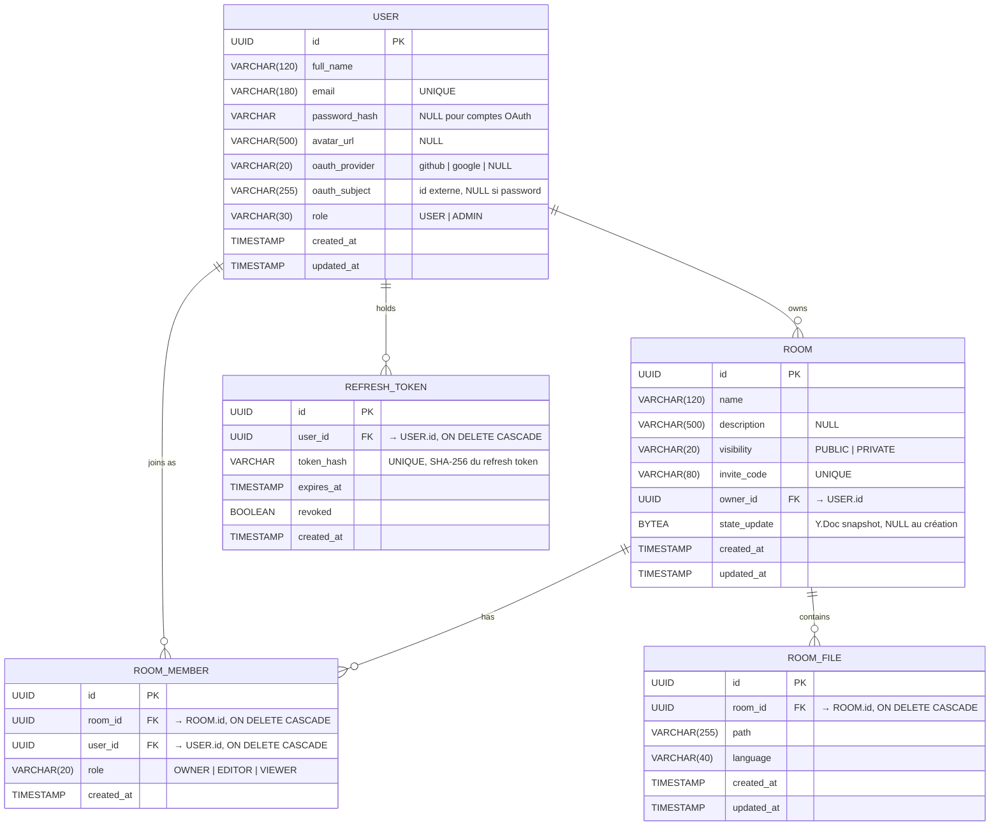

# Modèle Conceptuel de Données (MCD — Merise)

Modèle conceptuel de la base PostgreSQL de Codeleon. Cinq entités
principales, quatre associations. Toutes les contraintes d'unicité,
cardinalités et nullabilités sont rendues explicites.

## Cardinalités explicites

| Association | Cardinalité côté gauche | Cardinalité côté droit | Sens |
|---|---|---|---|
| USER `owns` ROOM | (1,1) | (0,n) | Une room a exactement un owner ; un user peut posséder plusieurs rooms ou aucune. |
| USER `joins` ROOM_MEMBER | (1,1) | (0,n) | Chaque appartenance lie un seul user ; un user peut appartenir à plusieurs rooms. |
| ROOM `has` ROOM_MEMBER | (1,1) | (1,n) | Chaque appartenance lie une seule room ; une room a au moins un membre (l'owner) à sa création. |
| ROOM `contains` ROOM_FILE | (1,1) | (1,n) | Chaque fichier appartient à une seule room ; une room contient au moins un fichier (créé par défaut au premier accès au snapshot). |
| USER `holds` REFRESH_TOKEN | (1,1) | (0,n) | Un refresh token appartient à un seul user ; un user peut avoir plusieurs tokens (multi-device). |

## Contraintes d'intégrité

- `USER.email` est `UNIQUE` (cas d'usage : pas deux comptes avec le
  même email, qu'ils soient password ou OAuth).
- `(USER.oauth_provider, USER.oauth_subject)` est `UNIQUE` via un index
  dédié — empêche deux comptes Codeleon liés à la même identité GitHub
  ou Google. Les couples NULL sont traités comme distincts (PostgreSQL
  comme H2), donc les comptes password classiques ne se gênent pas
  entre eux.
- `ROOM.invite_code` est `UNIQUE` — généré aléatoirement par le service
  à la création.
- `(ROOM_FILE.room_id, ROOM_FILE.path)` est `UNIQUE` — pas deux fichiers
  avec le même path dans la même room.
- `REFRESH_TOKEN.token_hash` est `UNIQUE` — empêche les collisions de
  hash SHA-256.
- Toutes les FK enfant utilisent `ON DELETE CASCADE` : supprimer une
  room supprime ses membres, ses fichiers ; supprimer un user supprime
  ses rooms (et donc, en cascade, leurs membres et fichiers) ainsi que
  ses refresh tokens.

## Choix de modélisation justifiés

- **`state_update` au niveau ROOM, pas ROOM_FILE.** Le `Y.Doc` collaboratif
  contient toutes les `Y.Text` de la room (une par chemin de fichier),
  le snapshot est donc room-scope par construction. Ce choix est rendu
  effectif par la migration V3 (avant V3, le snapshot vivait sur la
  ligne `room_files.path = 'main'`).
- **`password_hash` nullable.** Migration V4. Les comptes OAuth n'ont
  pas de mot de passe local — ils s'authentifient via leur provider.
- **`role` enum `OWNER | EDITOR | VIEWER` sur `ROOM_MEMBER`.** Le
  modèle distingue le créateur de la room (OWNER, supprime / renomme la
  room) des collaborateurs en écriture (EDITOR, peut éditer le code et
  exécuter le runner) et en lecture (VIEWER, n'envoie pas de mises à
  jour CRDT upstream).
- **`token_hash`, pas le token en clair.** Si la table fuite, l'attaquant
  ne peut pas réutiliser les refresh tokens.

## Migrations Flyway correspondantes

| Migration | Périmètre |
|---|---|
| `V1__init_auth_and_rooms.sql` | `users`, `rooms`, `room_members`, `refresh_tokens` |
| `V2__room_files.sql` | `room_files` (avec `state_update`, supprimé en V3) |
| `V3__multi_files.sql` | déplace `state_update` sur `rooms`, `room_files` devient pure métadonnée |
| `V4__oauth_users.sql` | rend `users.password_hash` nullable, ajoute `oauth_provider` + `oauth_subject` + index unique sur le couple |
