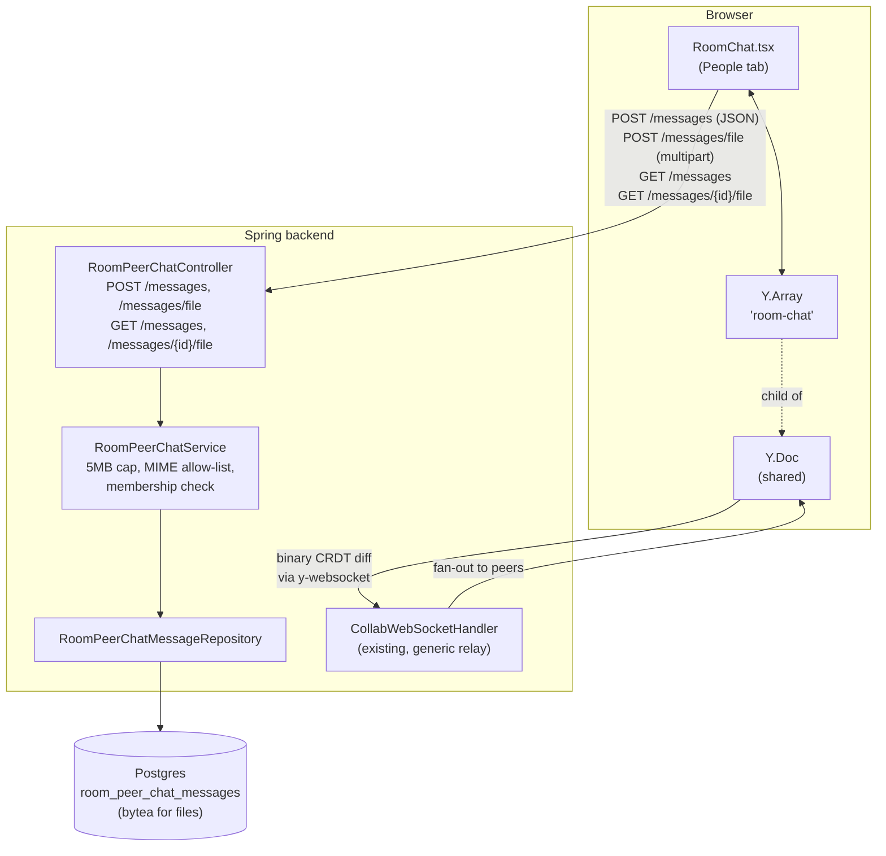
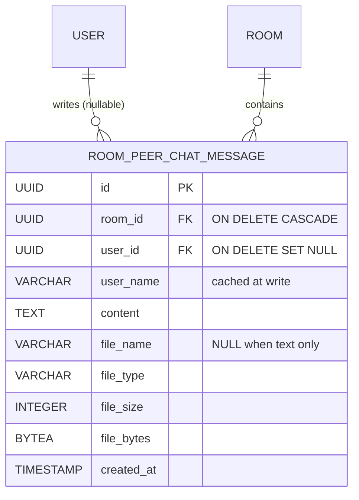

# Room peer chat with file attachments

> Documentation chapter for the PFE final report. Covers the design,
> architecture, and security model of the human-↔-human chat feature
> that lives in the room workspace's **People** tab — separate from the
> AI assistant chat in the **AI** tab.

---

## 1. What the feature does

When two or more users open the same Codeleon room, the **People** tab
in the right-hand panel shows:

- a compact list of the participants currently connected (Y.js
  awareness — same data that drives the multi-cursor colors in the
  editor), and
- a text-and-attachment chat where any member can write messages and
  share files with everyone else in the room.

The chat is **separate from the AI chat**: nothing typed here is
indexed for RAG, nothing the user types here goes through Ollama, and
the room owner cannot read individual private threads (because there
are no private threads — every message is for everyone in the room).

Supported attachment types: images (PNG, JPG, GIF, WebP, SVG), PDF,
plain text and source-code files, JSON, XML, and ZIP. Hard cap: 5 MB
per file.

## 2. Why this feature

Collaborative coding without a sidebar conversation is friction.
Codeleon's value proposition is "a room where teams meet to write
code"; a room without a chat forces users to fall back to Discord,
Slack, or WhatsApp to discuss what they're writing. Two consequences:

- **Context drift** — the discussion happens in one app while the
  artifact lives in another; later, nobody can reconstruct *why* a
  given decision was made.
- **Sovereignty regression** — Codeleon's whole pitch is "your code
  stays with you, no cloud LLM gets a copy". Sending the same code
  snippets through Slack pings undoes that posture for the discussion
  layer.

The peer chat closes the loop: the workspace, the run, the AI
assistant, the screenshots, and the discussion all live in the same
session, on the same sovereign backend.

## 3. Design constraints

| Constraint | What it forced |
|---|---|
| **Low send latency** | Messages have to feel instant. A 200 ms server round-trip on every keystroke-burst is fine; a 200 ms round-trip *before the message even appears for the sender* is not. |
| **Survive snapshot resets** | Codeleon persists rooms as a single Y.Doc snapshot blob. The blob can in theory be reset (admin action, migration, corruption). Chat history must not vanish when that happens. |
| **No new infrastructure** | No new message broker, no Redis pub/sub, no Kafka topic. The existing WebSocket relay (`y-websocket`) and Postgres are the only moving parts. |
| **5 MB attachment cap** | Bytea columns are convenient for backups but blow up `pg_dump` if abused. 5 MB lets users share screenshots, PDFs, short videos cropped to a clip — not full datasets. |
| **MIME allow-list, not deny-list** | Codeleon already runs a Docker sandbox for code execution; we don't want the chat to become a second exec vector by accident. Only image / text / PDF / JSON / XML / ZIP types pass the gate. |
| **Member-only access** | The same membership check as `RoomFileService.canRead` — if a user can see the files, they can chat. No new role to maintain. |

## 4. Architecture

The chat uses a **two-layer sync** with Postgres as the source of
truth and a Y.Array inside the shared Y.Doc as the realtime
broadcast channel.

```
              SEND from author
                    │
       ┌────────────┴───────────────┐
       ▼                            ▼
  POST /peer-chat/messages       Y.Array.push(message)
       │                            │
       │  (HTTP, ~50–200 ms)        │  (Y.js binary diff, <10 ms)
       ▼                            ▼
   Postgres                  y-websocket relay
   room_peer_chat_messages         │
       │                            ▼
       │                     other peers' observe()
       │                            │
       │                            ▼
       │                       re-render bubbles
       │
       │ (later, on a new peer joining or after a refresh)
       ▼
   GET /peer-chat/messages
       │
       ▼
   hydrate Y.Array, dedupe by id
```

### Why two layers

- **Y.Array alone** — fastest UX (no server roundtrip), free
  persistence via the Y.Doc snapshot. But: if the snapshot is ever
  cleared, history vanishes. Also: the snapshot is room-scoped, so
  archiving / pruning chat without losing editor state is awkward.
- **Postgres alone** — durable, queryable, easy to back up. But every
  send pays a roundtrip, and broadcast to other peers requires a new
  WebSocket topic to wire up.
- **Both** — author writes to DB (durable) AND to Y.Array (fast
  fan-out). Other peers see the Y.Array push immediately. The DB
  catches them up on mount via `GET /peer-chat/messages`. The two
  views reconcile by message id.

### Reconciliation

On mount the frontend fetches the last 200 messages from the DB,
merges them with whatever is already in the Y.Array (some peers may
have pushed during the load), de-duplicates by id, and **replaces**
the Y.Array contents with the merged list inside a `ydoc.transact`
block. That replacement is itself a CRDT operation that propagates to
other peers, so the whole tailnet ends up on the same canonical view.

### Component diagram



## 5. Database schema

Migration `V9__room_peer_chat.sql` adds one table.

```sql
CREATE TABLE room_peer_chat_messages (
    id          UUID PRIMARY KEY,
    room_id     UUID NOT NULL REFERENCES rooms(id) ON DELETE CASCADE,
    user_id     UUID REFERENCES users(id) ON DELETE SET NULL,
    user_name   VARCHAR(180) NOT NULL,   -- cached at write time
    content     TEXT NOT NULL,           -- caption + plain-text body
    file_name   VARCHAR(255),            -- nullable: only for attachments
    file_type   VARCHAR(120),
    file_size   INTEGER,
    file_bytes  BYTEA,
    created_at  TIMESTAMP NOT NULL
);

CREATE INDEX idx_room_peer_chat_messages_room_created
    ON room_peer_chat_messages(room_id, created_at);
```

Choices worth defending:

- **`ON DELETE CASCADE` on `room_id`** — deleting a room removes its
  chat (no orphan rows).
- **`ON DELETE SET NULL` on `user_id`** — deleting a user does *not*
  erase the room's discussion. The cached `user_name` keeps the
  history readable; the UI renders missing `userId` rows with a
  neutral grey colour.
- **Inline `BYTEA` for files** rather than a separate object store —
  Postgres backups stay self-contained, no second persistence layer to
  configure or monitor. The 5 MB cap keeps `pg_dump` manageable.
- **Single index `(room_id, created_at)`** — matches the only read
  pattern: "last N messages for this room, chronological".

### Entity model



## 6. API endpoints

All endpoints are protected by the standard JWT filter and a
membership check via `RoomFileService.canRead`.

### `GET /api/v1/rooms/{roomId}/peer-chat/messages?limit=200`

Returns the last `limit` messages (default and max: 200) for the
room, oldest-first.

```json
[
  {
    "id": "8d2…",
    "userId": "f70…",
    "userName": "Ayoub Bz",
    "content": "Here's the error log",
    "fileName": "stderr.txt",
    "fileType": "text/plain",
    "fileSize": 1432,
    "createdAt": "2026-05-30T11:42:18.013Z"
  }
]
```

Note: `fileBytes` is never returned in this listing — files are
fetched on demand via the dedicated download endpoint.

### `POST /api/v1/rooms/{roomId}/peer-chat/messages`

JSON body. Plain-text message.

```json
{ "content": "Tests pass, merging" }
```

Returns the saved message including its server-assigned `id` and
`createdAt`.

### `POST /api/v1/rooms/{roomId}/peer-chat/messages/file`

`multipart/form-data`. Two parts:

- `file` — the binary upload, max 5 MB, MIME must pass the allow-list.
- `caption` — optional plain-text caption, max 4000 chars.

Returns the saved message (without `fileBytes` — the file is fetched
separately).

### `GET /api/v1/rooms/{roomId}/peer-chat/messages/{messageId}/file`

Streams the file bytes with `Content-Disposition: inline` so the
browser previews images and PDFs directly. Requires the standard
`Authorization: Bearer <jwt>` header; the frontend therefore fetches
images with `fetch()` and converts the response to a blob URL rather
than relying on ``.

## 7. Frontend behaviour

`frontend-web/src/components/chat/RoomChat.tsx` orchestrates the
two-layer sync. Key behaviours:

| Action | What happens |
|---|---|
| Mount / room change | `fetchRoomPeerChatHistory()` → `merge()` with current Y.Array → `ydoc.transact(replace Y.Array contents with merged list)` |
| Receive a peer message | `yArray.observe()` callback fires → `setMessages(yArray.toArray())` → bubble appears, auto-scroll to bottom |
| Send a text message | `POST /messages` → on 200 OK, `yArray.push([fromApi(saved)])` → bubble appears for sender |
| Send a file | open native file picker → preview chip with name + size → optional caption → `POST /messages/file` (multipart) → on 200 OK, push to Y.Array |
| Preview an image | `fetch(file URL, Bearer token)` → blob → `URL.createObjectURL` → render in ``; clean up the URL on unmount |
| Download a non-image | click the chip → `fetch(file URL, Bearer token)` → blob → invisible `<a download>` triggers Save As |
| Read-only mode | `canSend={false}` hides the input. Bubbles still render. |

### Animation and density

The chat bubbles use the same colour palette as the multi-cursor
peers (`pickColor(userId)`), so the message author's bubble matches
their cursor colour in the editor — a small visual link between the
two surfaces that makes long sessions easier to follow.

The bubble layout follows the rest of the dense UI pass:
`text-[13px]` body, `text-[10px]` meta (name + time), `px-2.5 py-1.5`
padding inside bubbles, `max-w-[85%]` so even long messages keep a
shape and never fill the whole panel width.

## 8. Security model

| Threat | Mitigation |
|---|---|
| **Non-member reads / writes** | Every endpoint calls `roomFileService.canRead(roomId, user)`. Same gate as the file API. |
| **Uploading arbitrary executables** | MIME prefix allow-list (`image/`, `text/`, `application/pdf`, `application/json`, `application/xml`, `application/zip`). Anything else returns 400. The Docker sandbox elsewhere in the project would catch a runtime escape, but the chat is not a runtime — refusing the upload is cleaner. |
| **Storage exhaustion via large uploads** | Two-tier cap: Spring `max-file-size: 5MB` at the multipart parser, and `RoomPeerChatService.MAX_FILE_BYTES` at the service layer. A request larger than 5 MB never reaches the controller. |
| **Filename injection on download** | `RoomPeerChatService.sanitiseFileName()` strips path separators and control characters before the filename lands in `Content-Disposition`. |
| **Stolen file URL** | The file download endpoint requires the same JWT as the rest of the API. There are no signed URLs — once you leave the tailnet, the URL is useless. |
| **Member kicked out keeps access** | Membership is re-checked on every fetch (text history, individual file). A user who lost access immediately stops being able to read the chat. |

## 9. Trade-offs

- **Inline `BYTEA` vs object store**. Inline keeps backups
  self-contained but bloats `pg_dump`. We mitigated by enforcing a
  5 MB cap. At 5 MB × 200 messages × 100 rooms the worst case is
  100 GB — well above our needs but representable as a future
  migration target (move bytes to a dedicated bucket, keep the table
  for metadata) without touching the API or the frontend.
- **No streaming attachments**. The whole file is read into memory on
  upload and download. At 5 MB this is irrelevant; if we ever lift
  the cap, we'd switch to `OutputStream`-based serving.
- **No edit / delete on messages**. Deliberately out of scope for the
  PFE — gives a clean audit trail. Adding a soft-delete is a one-line
  column change later.
- **No reactions, no threads, no @mentions**. Out of scope. The chat
  is meant to support code discussion in the moment, not replace a
  team chat product.

## 10. Operational notes

- The 5 MB cap is set in two places — `application.yml`
  (`spring.servlet.multipart.max-file-size: 5MB`) and
  `RoomPeerChatService.MAX_FILE_BYTES`. If you raise one, raise the
  other; the multipart parser rejects first and returns a less
  descriptive error.
- Backups: the `room_peer_chat_messages` table is included in any
  standard `pg_dump`. The `BYTEA` column is hex-encoded in dumps; a
  100-message room with 5 MB attachments produces a ~500 MB dump
  segment.
- Snapshot resets: clearing a room's `state_update` blob no longer
  loses chat history (it would have before this feature added DB
  persistence). The Y.Array is rebuilt from the DB on the next mount.

## 11. Summary statement (for the soutenance)

> The peer chat closes the workflow loop in a Codeleon room. Two-layer
> sync — Y.Array for live broadcast, Postgres for durability — gives
> the UX of an in-memory chat with the durability of a relational
> database, without introducing a new piece of infrastructure (no
> message broker, no second persistence layer). Attachments are
> capped, MIME-validated, member-gated, and stored inline so backups
> stay self-contained. The feature shares the room's existing
> membership model and WebSocket transport, so adding it cost one
> Flyway migration, one entity, one service, one controller, and one
> React component — total deliverable: ~700 lines of new code, zero
> new dependencies, fully tested against the same auth and
> authorisation gates as the rest of the API.
