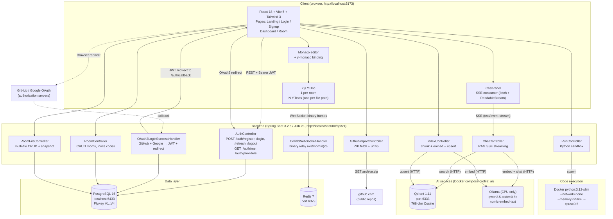

# Component Diagram

Static deployment view of every Codeleon piece and how they talk to each
other. Boxes are processes, arrows are protocols. Read top-to-bottom:
client → backend → data + AI + sandbox.

## Notes for the defense

- **Single Y.Doc per room with N Y.Texts.** One byte[] snapshot persists
  every file at once. The WebSocket handler is a pure binary relay — it
  does not run a server-side Y.Doc, which is why Yjs's "sync step 2"
  never fires server-side and the frontend marks the room ready as soon
  as the WS opens (the prior state is restored from REST snapshot).
- **OAuth registers both providers programmatically.** A
  `@ConditionalOnExpression`-gated bean assembles the
  `ClientRegistrationRepository` only from providers whose env vars are
  set, so the backend boots clean even with no credentials configured
  and the frontend hides the relevant buttons via `/auth/providers`.
- **The sandbox container has `--network=none`.** User-supplied Python
  code cannot reach Postgres / Ollama / Qdrant or the public internet.
- **Ollama and Qdrant live behind the `ai` Docker compose profile.** The
  core stack (Postgres + Redis) boots without them; flipping
  `AI_ENABLED=true` and bringing up the profile turns on RAG.
