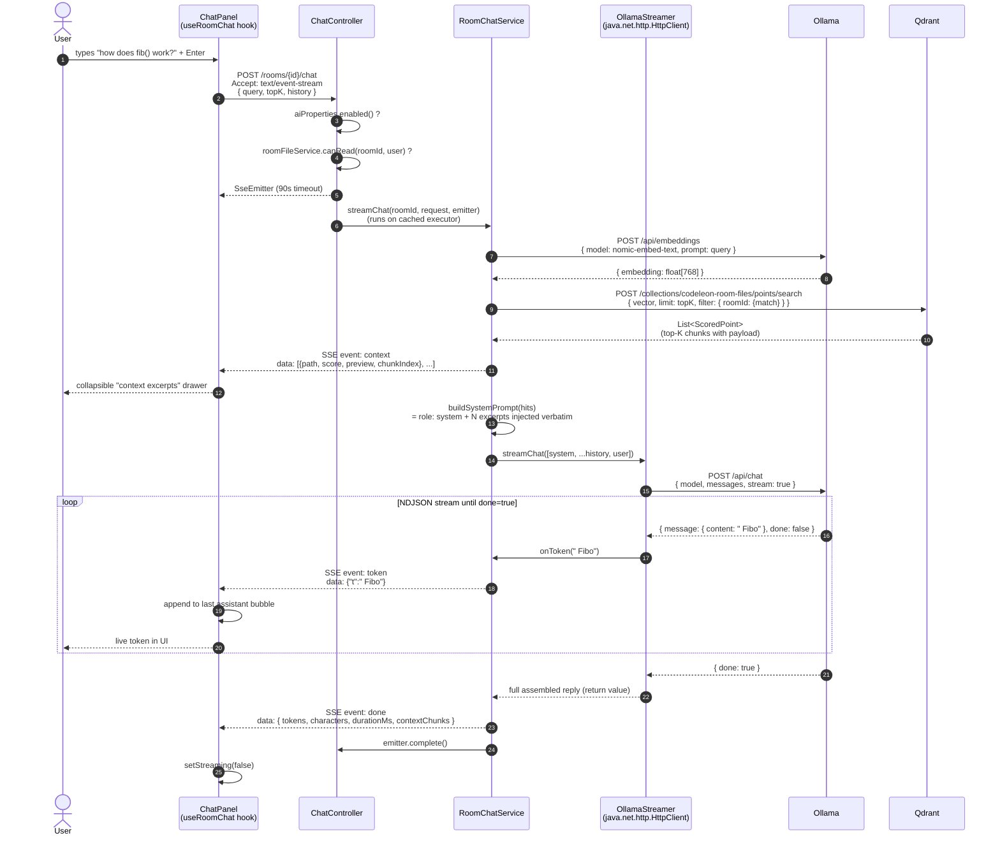

# Sequence — RAG chat

How a question typed in the AI assistant panel becomes a streamed,
context-grounded answer. Covers the embed → vector search → prompt
assembly → token streaming pipeline end to end.

## Notes

- **`event: context` arrives before any token.** It carries truncated
  previews of every chunk Qdrant returned plus their cosine score, so
  the UI can show a collapsible "I read these N excerpts" panel before
  the model starts answering. This is critical UX — users trust an
  answer more when they see it is grounded in their own code.
- **Tokens are wrapped as `{"t": "..."}`** instead of being emitted
  raw. SSE's "strip one leading space after the colon" rule eats real
  whitespace at token boundaries when the stream contains plain text.
  Wrapping in JSON sidesteps the ambiguity entirely.
- **Embed and search are blocking**, but the chat call uses
  `java.net.http.HttpClient`'s line-streaming
  `BodyHandlers.ofInputStream` to read NDJSON without buffering. We
  did not pull in `spring-boot-starter-webflux` — the JDK HTTP client
  is enough.
- **The success handler runs on a cached executor**, not the request
  thread. The Tomcat connection thread returns the `SseEmitter` and is
  freed immediately; the actual streaming runs in the background until
  `emitter.complete()` is called.
- **Filter-by-roomId at search time** means a user querying their own
  room never sees chunks belonging to a different room, even though
  every chunk lives in the same Qdrant collection.
