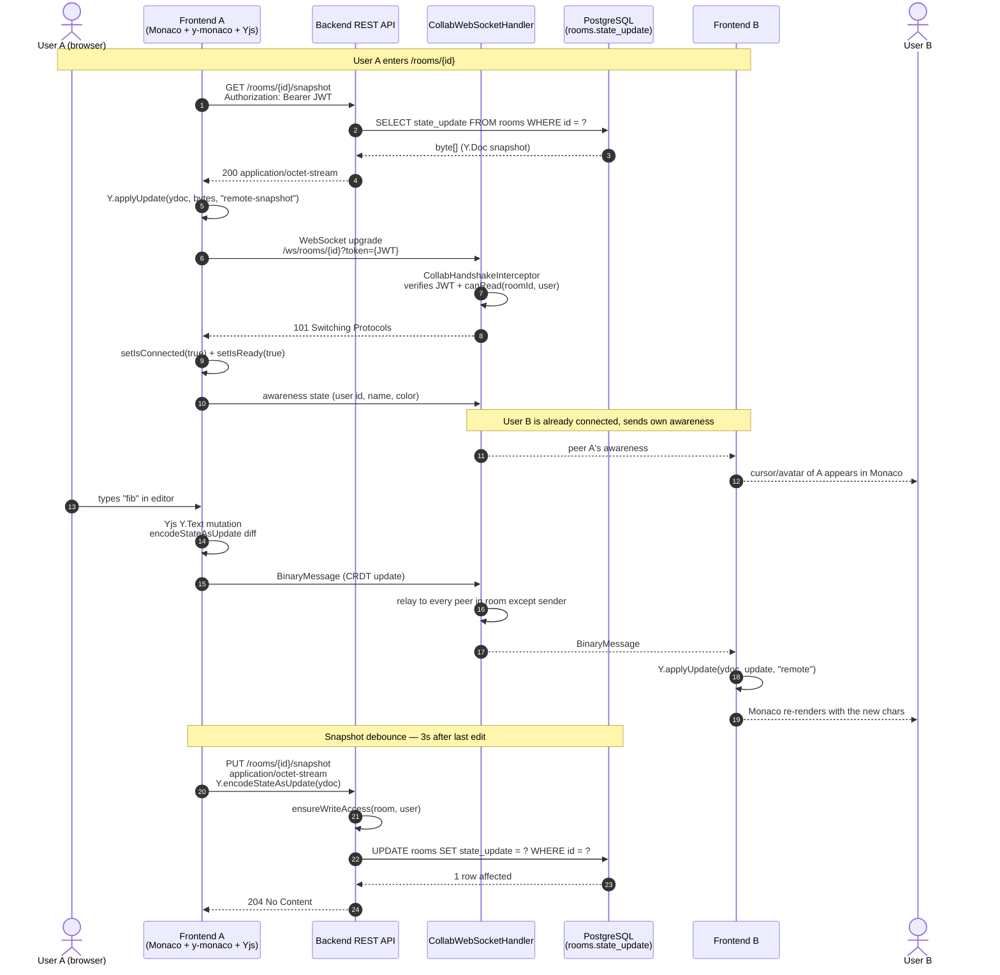

# Sequence — Real-time collaborative editing

How a keystroke from one user lands in another user's Monaco editor.
Captures the whole loop: REST snapshot bootstrap, WebSocket handshake,
binary CRDT relay, and debounced server-side persistence.

## Notes

- **Initial state is restored via REST**, not via the Yjs sync protocol.
  Our backend handler is a binary relay only — it does not run a
  server-side `Y.Doc`. This is why `useCollabRoom` flips `isReady=true`
  on the WebSocket `connected` status (the snapshot already loaded
  before the WS opened), and not on Yjs's `sync` event which never
  fires when only one peer is in the room.
- **Frame 7 is the JWT handshake check.** `CollabHandshakeInterceptor`
  pulls the token from the query string, validates it via `JwtService`,
  and stores the resolved `User` and a `canEdit` flag on the WebSocket
  session attributes. VIEWER-role peers connect successfully but the
  handler refuses to relay frames coming from them upstream.
- **Awareness uses the same WebSocket** as CRDT updates; y-monaco
  encodes peer cursor positions inside the same binary protocol.
- **Snapshot persistence is debounced** at 3000 ms in
  `useCollabRoom.ts` (`SNAPSHOT_DEBOUNCE_MS`) to avoid hammering the DB
  during sustained typing.
